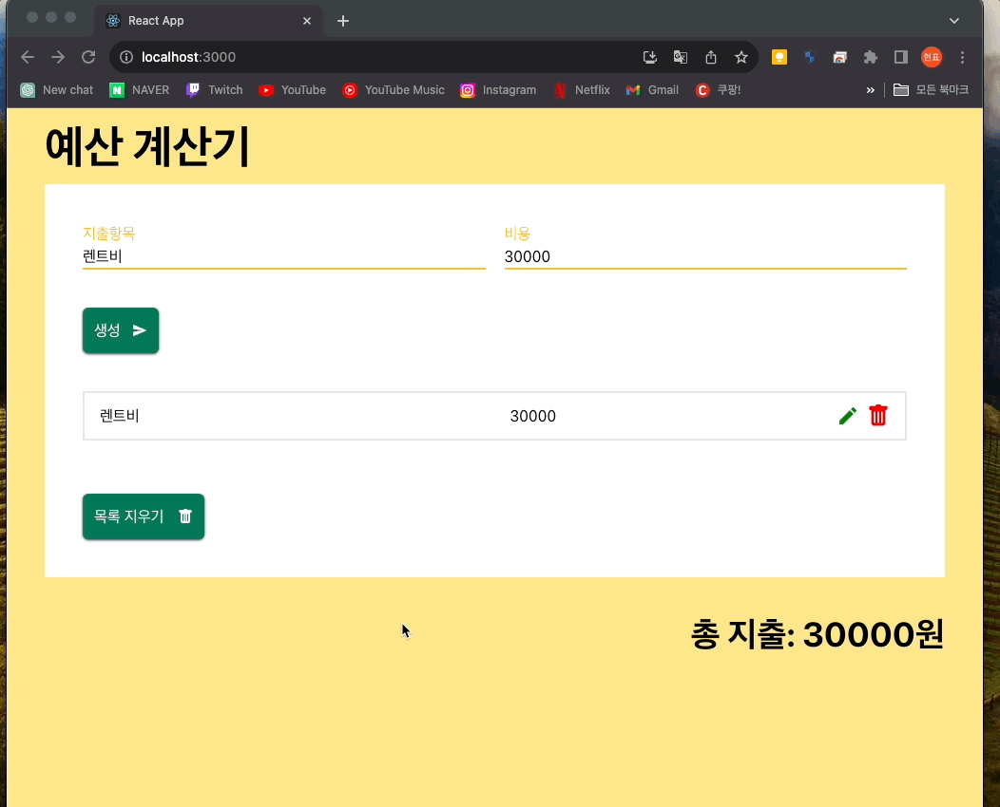

# React를 이용하여 CRUD 앱 만들기

## 소개

React를 이용하여 위와 같은 앱 만들기

## 실제 작동 영상

### 생성

### 삭제

### 전체삭제

### 수정(모달 이용)

### 저장(local storage)

## 실행방법

하단 스크립트 2개를 실행하면 됩니다

### `npm install`

### `npm start`

[이 링크](http://localhost:3000)로 접속하여 확인 가능합니다. 

